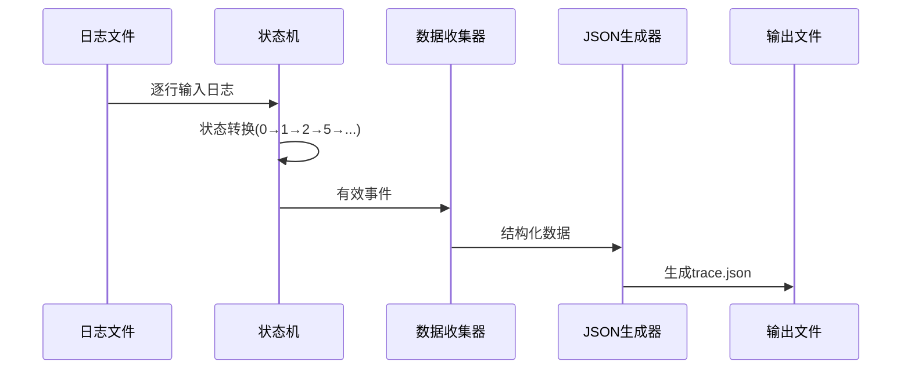

原来的脚本可以使用（问一下学长哪里出问题了）

---
脚本流程
---

### 一、初始化阶段
1. **依赖加载**
   ```python
   import re, subprocess, io, json, sys  # 加载正则、系统命令、IO、JSON等模块
   ```

2. **文件打开**
   ```python
   fp = open('dumped_data.txt', "r")  # 打开uftrace日志文件
   ```

3. **全局变量初始化**
   ```python
   task_context_collection = []   # 有效事件收集器
   future_stack = []             # 调用栈管理
   find_task_state = 0           # 状态机初始状态(0)
   polled_future_number = 0      # Future调用深度
   thread_list = []              # 线程列表
   process_name = sys.argv[1]    # 从命令行获取进程名
   output_name = sys.argv[2]+".json"  # 输出文件名
   enable_getting_location = 0   # 源码定位开关
   ```

---

### 二、命令行参数处理
4. **参数解析**
   ```python
   if len(sys.argv) == 4 and sys.argv[3] == "--get-location":
       enable_getting_location = 1  # 启用源码定位
   ```

---

### 三、主循环处理日志
5. **逐行读取日志**
   ```python
   for line in fp:  # 遍历日志每一行
       # 处理逻辑开始...
   ```

6. **线程检测**
   ```python
   if re.search("reading (.*).dat", line):
       thread_id = re.findall("reading (.*).dat", line)[0]
       thread_list.append(thread_id)  # 记录所有线程ID
   ```

---

### 四、状态机核心逻辑
7. **状态0：初始状态**
   ```python
   if find_task_state == 0:
       if re.search(r"entry] _<async_std..task..builder", line):
           future_stack.append("SupportTaskLocals@0")  # 压栈
           find_task_state = 1  # 转至状态1
   ```

8. **状态1：主任务上下文**
   ```python
   elif find_task_state == 1:
       if re.search(r"entry] _<core..future..from_generator", line):
           depth = int(re.findall(r"depth: (\d+)", line)[0])
           polled_future_number = depth
           find_task_state = 2  # 转至状态2
   ```

9. **状态2：处理GenFuture**
   ```python
   elif find_task_state == 2:
       if re.search(fr"depth: {polled_future_number+1}", line):
           future_stack.append("GenFuture@2") 
           find_task_state = 3  # 转至状态3
   ```

10. **状态5：用户自定义Future**
    ```python
    elif find_task_state == 5:
        if re.search(r"exit ] "+re.escape(future_stack[-1]), line):
            future_stack.pop()  # 弹栈
            find_task_state = int(future_stack[-1].split("@")[1])  # 恢复前状态
    ```

---

### 五、数据收集阶段
11. **事件捕获与存储**
    ```python
    # 所有状态共有的处理逻辑
    if 事件匹配成功:
        task_context_collection.append(line)  # 存入待处理集合
    ```

---

### 六、JSON生成阶段
12. **输出函数调用**
    ```python
    output_in_json(
        process_name,
        thread_list,
        task_context_collection,
        output_name,
        enable_getting_location
    )  # 最终生成Trace Event格式
    ```

---

### 关键过程图解


